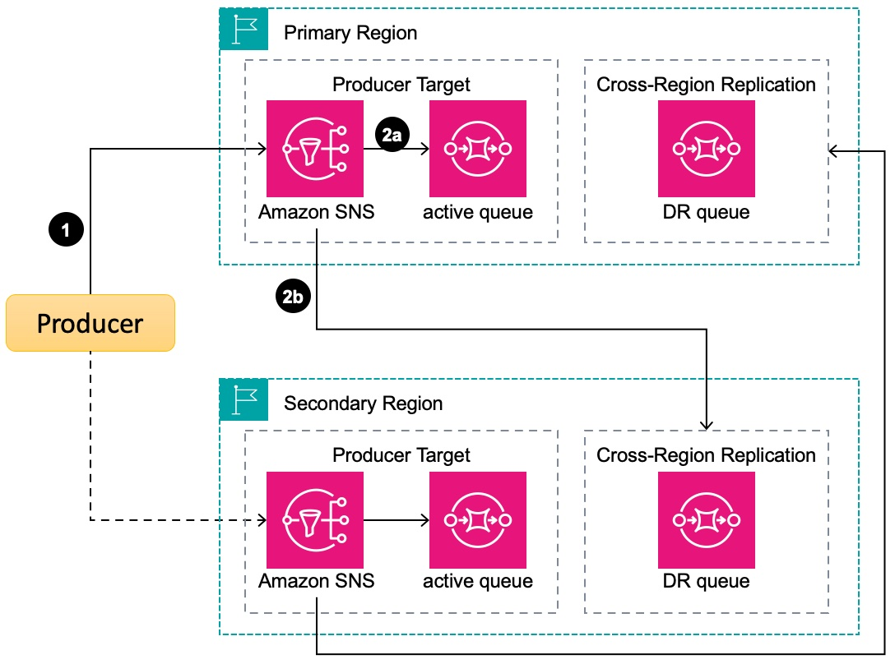

# SQS Multi-Region: SNS Fan-Out Pattern

Amazon Simple Queue Service (SQS) is widely adopted by organizations for its ability to reliably decouple microservices, process event-driven applications, and handle high-volume message delivery without infrastructure management overhead. As businesses face increasing demands for 24/7 availability and regulatory requirements for geographic redundancy, many are exploring multi-region architectures to enhance their messaging systems' resilience against regional outages. To address this need, Amazon SNS's cross-region delivery capabilities allow messages to be sent to SQS queues in different regions, enabling customers to implement robust, fault-tolerant messaging architectures that span multiple AWS regions, thus ensuring business continuity and maintaining message integrity even during localized disruptions.



## Deployment Instructions
1. Create a new directory, navigate to that directory in a terminal and clone the GitHub repository:
    ```
    git clone https://github.com/aws-samples/sample-sns-sqs-multi-region.git
    ```
1. Change directory to:
    ```
    cd sample-sns-sqs-multi-region
    ```
1. [Optional] Configure your regions. By defaut, we will deploy stacks on us-east-1 and us-west-2. If you want to change those regions, edit ./bin/config.sh, on lines 5 and 6:
    ```bash
    #!/bin/bash
    export STACK_NAME=sns-sqs-multi-region
    export PRIMARY_ENV=primary
    export SECONDARY_ENV=secondary
    export PRIMARY_REGION=us-east-1
    export SECONDARY_REGION=us-west-2
    ```

1. From the command line, use shell script to deploy the AWS resources for the stack as specified in the template.yml file on the primary Region:
    ```
    ./bin/deploy-stacks.sh 
    ```


## How it works

This stack will deploy an Amazon API Gateway Rest Regional API with a Lambda integration. The AWS Lambda function is written in Python3.9. The function returns a small message with the service name and the Region it is deployed at. The inline code of the lambda is written in the template itself.

## Testing

1. Install libraries:
    ```
    bundle install
    ```
1. Give execution permission to the shell scripts:
    ```
    chmod +x ./bin/*
    ```
1. run the producer, publishing messages to the primary region (in this example, us-east-1):
    ```
    ./bin/run-producer.sh primary
    ```

    You will see that every second, the producer sends a message to the SNS topic, with a JSON payload with the timestamp when the message was generated, in unix format.

    ```
    [15:10:12.000] Publishing to us-east-1 ...
    [15:10:13.000] Sending message {"recorded_at":1743433813000} ...
    [15:10:14.000] Sending message {"recorded_at":1743433814000} ...
    [15:10:15.000] Sending message {"recorded_at":1743433815000} ...
    [15:10:16.000] Sending message {"recorded_at":1743433816000} ...
    [15:10:17.000] Sending message {"recorded_at":1743433817000} ...
    [15:10:18.000] Sending message {"recorded_at":1743433818000} ...
    [15:10:19.000] Sending message {"recorded_at":1743433819000} ...
    [15:10:20.000] Sending message {"recorded_at":1743433820000} ...
    ```

1. Check Message Traffic on the ClowWatch Dashboard
    After deploying the stacks, you will see a CloudWatch dashboard created on your primary region. The dashboard name starts with "SnsSqsMultiRegion-". Open the dashboard and after a few minutes, you should see traffic both on the primary SNS topic and on both active and dr queues:

    

    Since the producer sends 1 message per second to the SNS topid and both the primary and coss-region dr queues are subscribing to it, the bashboard shows 300 messages being published to the SNS topic and received from both SQS queues.

1. To simulate a regional failover, kill the producer and run it again, publishing messages now to the dr region (in this example, us-west-2):
    ```
    ./bin/run-producer.sh secondary
    ```

    You will see that every second, the producer now sends a message to the SNS topic on the dr region.

    ```
    [15:44:25.876] Publishing to us-west-2 ...
    [15:44:26.005] Sending message {"recorded_at":1745613866005} ...
    [15:44:27.000] Sending message {"recorded_at":1745613867000} ...
    [15:44:28.001] Sending message {"recorded_at":1745613868001} ...
    [15:44:29.003] Sending message {"recorded_at":1745613869003} ...
    [15:44:30.005] Sending message {"recorded_at":1745613870005} ...
    [15:44:31.005] Sending message {"recorded_at":1745613871005} ...
    [15:44:32.001] Sending message {"recorded_at":1745613872001} ...
    [15:44:33.005] Sending message {"recorded_at":1745613873005} ...
    ```

    If you wait a few minutes, the dashboard will now show traffic going to the secondary SNS topic on the dr region (us-west-2 in this example) and to the  SQS queues subscribed to that topic.


    

## Cleanup
 
Delete the stacks on both regions:
```bash
./bin/delete-stacks.sh 
```

----
Copyright 2023 Amazon.com, Inc. or its affiliates. All Rights Reserved.

SPDX-License-Identifier: MIT-0
